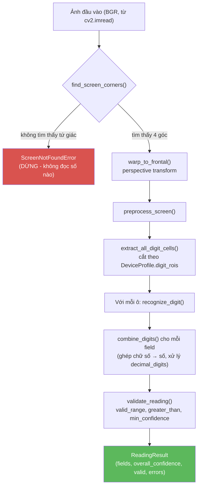
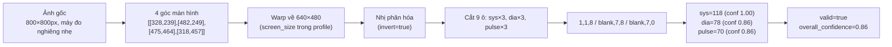

# Thuật toán & Luồng xử lý

Tài liệu này giải thích **chi tiết từng bước** thuật toán, dành cho người mới hoàn toàn
với dự án (không cần biết trước OpenCV hay xử lý ảnh). Nếu bạn chỉ cần biết cách gọi hệ
thống, xem [README.md](README.md) hoặc [INTEGRATION.md](INTEGRATION.md) thay vì file này.

## Mục lục

1. [Bài toán & ý tưởng cốt lõi](#1-bài-toán--ý-tưởng-cốt-lõi)
2. [Sơ đồ tổng thể](#2-sơ-đồ-tổng-thể)
3. [Bước 1 — Phát hiện màn hình](#bước-1--phát-hiện-màn-hình-screen_detectionpy)
4. [Bước 2 — Duỗi thẳng về nhìn chính diện](#bước-2--duỗi-thẳng-về-nhìn-chính-diện-warp_to_frontal)
5. [Bước 3 — Tiền xử lý ảnh](#bước-3--tiền-xử-lý-ảnh-preprocessingpy)
6. [Bước 4 — Tách từng ô chữ số](#bước-4--tách-từng-ô-chữ-số-roipy)
7. [Bước 5 — Nhận dạng 7 đoạn cho từng ô](#bước-5--nhận-dạng-7-đoạn-cho-từng-ô-rule_basedpy)
8. [Bước 6 — Ghép số & kiểm tra logic](#bước-6--ghép-số--kiểm-tra-logic-postprocesspy)
9. [Ví dụ đầy đủ từ đầu đến cuối](#ví-dụ-đầy-đủ-từ-đầu-đến-cuối)
10. [Bảng tham số quan trọng & lý do chọn](#bảng-tham-số-quan-trọng--lý-do-chọn)
11. [Lỗi thực tế → bước nào gây ra](#lỗi-thực-tế--bước-nào-gây-ra)
12. [Thuật ngữ](#thuật-ngữ)

---

## 1. Bài toán & ý tưởng cốt lõi

**Đầu vào:** 1 ảnh chụp (điện thoại, webcam...) một máy đo điện tử có màn hình LCD hiển
thị số dạng **7 đoạn** (7-segment) — kiểu chữ số bạn thấy trên đồng hồ điện tử, máy tính
bỏ túi, máy đo huyết áp, máy đo đường huyết...

**Đầu ra:** các số đã đọc được (vd SYS=118, DIA=78, PULSE=70) kèm độ tin cậy.

**Ý tưởng cốt lõi — quan trọng nhất để hiểu toàn bộ dự án:** đây là thuật toán
**rule-based** (dựa trên luật cố định do con người thiết kế), **không phải machine
learning**. Không có "học" nào diễn ra — mọi quyết định đều dựa trên phép đo hình học
tường minh (tỷ lệ pixel sáng trong một vùng, độ dài cạnh, diện tích...) mà bạn có thể đọc
thẳng trong code và hiểu ngay tại sao thuật toán ra quyết định đó. Đánh đổi:
- ✅ Không cần dữ liệu huấn luyện, chạy được ngay, chạy nhanh (không cần GPU), dễ debug
  (biết chính xác bước nào, dòng code nào gây ra kết quả sai).
- ❌ Không "khoan dung" được với input khác thường — nếu input lệch khỏi giả định thiết
  kế (font nghiêng, góc chụp lạ, vật cản), thuật toán sẽ sai hoặc dừng lại, chứ không tự
  suy luận như một model đã học từ nhiều biến thể.

Toàn bộ pipeline chia làm 2 giai đoạn lớn:

| Giai đoạn | Trả lời câu hỏi | Module |
|---|---|---|
| **A. Định vị** | Màn hình LCD nằm ở đâu trong ảnh? | `screen_detection.py` |
| **B. Đọc số** | Từng ô chữ số hiển thị số mấy? | `preprocessing.py`, `roi.py`, `rule_based.py`, `postprocess.py` |

`pipeline.py` (class `ReadingPipeline`) là nơi nối 2 giai đoạn này lại.

## 2. Sơ đồ tổng thể



Đúng bằng `ReadingPipeline.run()` trong `src/bp_ocr/pipeline.py` — mở file đó lên đọc
song song với sơ đồ trên sẽ thấy khớp từng dòng.

---

## Bước 1 — Phát hiện màn hình (`screen_detection.py`)

**Hàm:** `find_screen_corners(image) -> np.ndarray | None`

**Mục tiêu:** tìm 4 góc của hình chữ nhật màn hình LCD trong ảnh gốc (ảnh có thể chụp
nghiêng, xa, có nền xung quanh).

**Thuật toán, từng dòng:**

1. **Chuyển ảnh xám + làm mờ nhẹ** (`cv2.cvtColor` + `cv2.GaussianBlur` kernel 5×5) — làm
   mờ để giảm nhiễu li ti, tránh Canny bắt phải các cạnh giả do noise.
2. **Dò cạnh bằng Canny** (`cv2.Canny(blurred, 50, 150)`) — thuật toán chuẩn phát hiện
   biên (edge) trong xử lý ảnh, 2 số 50/150 là ngưỡng thấp/cao để quyết định pixel nào là
   "cạnh".
3. **Giãn nở cạnh** (`cv2.dilate`, kernel 3×3) — nối các đoạn cạnh bị đứt quãng thành
   đường liền mạch, để bước tìm contour sau không bị chia nhỏ vụn.
4. **Tìm tất cả contour (đường viền khép kín)** bằng `cv2.findContours(edges,
   cv2.RETR_LIST, ...)`. **Lưu ý quan trọng:** dùng `RETR_LIST` chứ không phải
   `RETR_EXTERNAL` — đây là bài học thực tế trong quá trình phát triển: nếu viền thân máy
   (vỏ nhựa) tạo thành 1 contour khép kín lớn hơn và bao quanh viền màn hình LCD,
   `RETR_EXTERNAL` sẽ **loại bỏ** contour màn hình vì coi nó là "lồng bên trong" một
   contour khác. `RETR_LIST` giữ lại tất cả, để bước sau tự chọn.
5. **Sắp xếp contour theo diện tích giảm dần**, chỉ xét 10 contour lớn nhất (đủ để bao
   phủ hầu hết trường hợp, tránh xét toàn bộ hàng trăm contour nhiễu nhỏ).
6. **Với mỗi contour ứng viên:**
   - Bỏ qua nếu diện tích < 5% diện tích ảnh (`if area < 0.05 * image_area: break` — vì
     đã sắp xếp giảm dần, contour sau còn nhỏ hơn nên dừng sớm).
   - Xấp xỉ đa giác bằng `cv2.approxPolyDP` (làm trơn contour phức tạp thành đa giác ít
     đỉnh hơn, sai số cho phép = 2% chu vi).
   - Nếu đa giác xấp xỉ có **đúng 4 đỉnh** → coi đây là màn hình, trả về ngay (contour đầu
     tiên đủ lớn và có 4 đỉnh, vì danh sách đã sắp xếp theo diện tích giảm dần).
7. Không tìm thấy contour 4 đỉnh nào đủ lớn → trả về `None` → pipeline dừng lại với
   `ScreenNotFoundError`.

**Sắp xếp 4 góc:** `_order_corners()` dùng một mẹo hình học đơn giản: tổng tọa độ
`x+y` nhỏ nhất là góc trên-trái, lớn nhất là góc dưới-phải; hiệu tọa độ `x-y` nhỏ nhất là
góc trên-phải, lớn nhất là góc dưới-trái. Thứ tự này bắt buộc phải đúng vì bước warp tiếp
theo ánh xạ theo đúng thứ tự [trên-trái, trên-phải, dưới-phải, dưới-trái].

**Vì sao đây là bước quan trọng nhất:** nếu bước này sai hoặc thất bại, **toàn bộ các
bước sau không chạy** (`ReadingPipeline.run()` raise `ScreenNotFoundError` ngay). Không có
cơ chế "cố gắng đọc dù không chắc" — đây là lựa chọn thiết kế có chủ đích: thà báo lỗi rõ
ràng còn hơn trả về số sai mà người dùng tưởng là đúng.

## Bước 2 — Duỗi thẳng về nhìn chính diện (`warp_to_frontal`)

**Hàm:** `warp_to_frontal(image, corners, output_size) -> np.ndarray`

Ảnh chụp thực tế hầu như luôn bị nghiêng (góc chụp không vuông góc với màn hình). Bước
này dùng **perspective transform** (phép biến đổi phối cảnh) để "duỗi" 4 góc đã tìm được
ở Bước 1 thành đúng 4 góc của một hình chữ nhật chuẩn, kích thước `output_size` (khai báo
trong device profile qua `screen_size`, vd `[640, 480]`).

Về bản chất: `cv2.getPerspectiveTransform` tính ra 1 ma trận 3×3 ánh xạ 4 điểm nguồn
(`corners`) sang 4 điểm đích (4 góc hình chữ nhật `output_size`), rồi
`cv2.warpPerspective` áp dụng ma trận đó lên toàn bộ ảnh. Kết quả: dù ảnh gốc chụp nghiêng
thế nào, ảnh sau bước này **luôn có cùng kích thước và bố cục** — đây chính là điều kiện
tiên quyết để bước sau (cắt ô theo tọa độ cố định trong device profile) hoạt động đúng.

**Hệ quả quan trọng cho việc đo `digit_rois`:** vì mọi ảnh sau bước này đều được chuẩn hóa
về cùng `screen_size`, tọa độ `digit_rois` trong device profile là **tọa độ cố định trên
ảnh đã warp**, không phải tọa độ trên ảnh gốc — đây là lý do khi hiệu chỉnh 1 device
profile mới, bạn luôn phải nhìn vào ảnh **đã warp** (xem `docs/CALIBRATION_GUIDE.md`).

## Bước 3 — Tiền xử lý ảnh (`preprocessing.py`)

**Hàm:** `preprocess_screen(screen, invert) -> np.ndarray` (nhị phân, chỉ có giá trị 0
hoặc 255)

4 bước con, chạy tuần tự:

1. **`to_grayscale`** — ảnh màu (BGR, 3 kênh) → ảnh xám (1 kênh). Màu sắc không quan
   trọng cho việc đọc số, chỉ độ sáng/tối mới quan trọng.
2. **`enhance_contrast`** — dùng CLAHE (*Contrast Limited Adaptive Histogram
   Equalization*, `clipLimit=3.0`, chia lưới 8×8) để tăng tương phản **cục bộ** — chịu
   được ảnh sáng không đều (vd 1 góc màn hình bị lóa nhẹ, 1 góc hơi tối) tốt hơn tăng
   tương phản toàn cục.
3. **`binarize`** — nhị phân hóa bằng **ngưỡng Otsu** (`cv2.THRESH_OTSU`): thuật toán tự
   động tìm ngưỡng sáng/tối tối ưu dựa trên histogram của chính ảnh đó (không phải số cố
   định), rồi gán 255 (trắng) cho nét chữ, 0 (đen) cho nền. Tham số `invert` (khai báo
   trong device profile) quyết định chiều: `invert=True` dùng khi chữ số **tối** trên nền
   LCD **sáng** (phổ biến nhất) — dùng `THRESH_BINARY_INV` để pixel *tối hơn* ngưỡng biến
   thành *trắng* trong ảnh nhị phân.
4. **`clean_morphology`** — phép toán hình thái học (kernel 2×2): "mở" (`MORPH_OPEN`,
   xóa nhiễu hạt nhỏ) rồi "đóng" (`MORPH_CLOSE`, lấp khe hở nhỏ trong nét chữ). Giúp nét
   chữ liền mạch hơn trước khi đo tỷ lệ ở Bước 5.

Kết quả cuối: ảnh nhị phân sạch, nơi **255 = nét chữ LCD đang sáng, 0 = nền** — quy ước
này được toàn bộ `rule_based.py` giả định sẵn (xem docstring đầu file đó).

## Bước 4 — Tách từng ô chữ số (`roi.py`)

**Hàm:** `extract_all_digit_cells(screen, profile) -> {"sys": [cell0, cell1, cell2], ...}`

Với mỗi field (vd `sys`, `dia`, `glucose`...) khai báo trong device profile, cắt ảnh nhị
phân (từ Bước 3) theo tọa độ `digit_rois` — **mỗi ô chữ số có ROI (x, y, w, h) riêng**,
không chia đều 1 vùng field thành N phần bằng nhau.

**Vì sao không chia đều?** Trên nhiều máy đo thật, khoảng cách giữa các chữ số trong cùng
1 field **không đều nhau** — ví dụ chữ số hàng trăm thường tách riêng, có khoảng trống lớn
trước 2 chữ số cuối (xem comment đầu file `roi.py`, được viết ra sau khi quan sát trực
tiếp trên ảnh Omron thật). Chia đều sẽ làm lệch tọa độ đo ở Bước 5.

**Quy tắc bắt buộc khi đo `digit_rois` (hay bị hiểu nhầm nhất):** mỗi ROI phải có kích
thước bằng **cả một ô chữ số đầy đủ** (như thể nó đang chứa số "8", chữ số dùng đủ cả 7
đoạn), **không phải** bounding box bó sát nét chữ thực tế đang hiển thị. Lý do nằm ở
chính cách Bước 5 hoạt động — đọc tiếp mục dưới sẽ rõ tại sao.

## Bước 5 — Nhận dạng 7 đoạn cho từng ô (`rule_based.py`)

Đây là bước "lõi" của thuật toán. Cần hiểu khái niệm **màn hình 7 đoạn** trước:

```
 _a_
f|   |b
 |_g_|
e|   |c
 |_d_|
```

Mỗi chữ số 0–9 được tạo thành bằng cách bật/tắt 7 đoạn `a` đến `g`. Ví dụ số "1" chỉ bật
2 đoạn `b`, `c` (2 nét dọc bên phải); số "8" bật cả 7 đoạn.

### 5.1. Đo tỷ lệ pixel sáng trong từng vùng (`measure_segment_ratios`)

`SEGMENT_REGIONS` định nghĩa vị trí **tương đối** (tỷ lệ 0–1 theo chiều rộng/cao của ô)
của từng đoạn:

```python
SEGMENT_REGIONS = {
    "a": (0.20, 0.00, 0.60, 0.20),   # thanh ngang trên
    "b": (0.75, 0.10, 0.25, 0.35),   # dọc trên-phải
    "c": (0.75, 0.55, 0.25, 0.35),   # dọc dưới-phải
    "d": (0.20, 0.85, 0.60, 0.15),   # thanh ngang dưới
    "e": (0.00, 0.55, 0.25, 0.35),   # dọc dưới-trái
    "f": (0.00, 0.10, 0.25, 0.35),   # dọc trên-trái
    "g": (0.20, 0.425, 0.60, 0.15),  # thanh ngang giữa
}
```

Mỗi tuple là `(fx, fy, fw, fh)` — vị trí và kích thước vùng đoạn tính theo % chiều
rộng/cao của **cả ô chữ số**. Đây chính là lý do Bước 4 yêu cầu ROI phải là "cả ô": nếu ô
bị cắt bó sát nét chữ thực tế (ví dụ với số "1" chỉ chiếm phần bên phải), các vùng % này
sẽ tính sai vị trí — đo nhầm vào nền/nét của chữ số khác. Đây là lỗi thực tế đã gặp nhiều
lần trong quá trình phát triển dự án (xem mục 11 bên dưới).

Với mỗi vùng, `measure_segment_ratios` đếm tỷ lệ pixel = 255 trong vùng đó:

```python
ratios["a"] = so_pixel_trang_trong_vung_a / tong_so_pixel_vung_a
```

Kết quả: 1 dict 7 số thực trong khoảng [0, 1], vd `{"a": 0.85, "b": 0.90, "c": 0.12, ...}`.

### 5.2. Xác định "bật/tắt" từng đoạn

Một đoạn được coi là **"bật"** nếu tỷ lệ đo được ≥ `SEGMENT_ON_THRESHOLD` (hiện tại =
**0.30**, giảm từ 0.35 ban đầu — xem lý do ở mục 10). Nếu **không đoạn nào** vượt quá
`BLANK_ON_RATIO_THRESHOLD` (= 0.05), ô được coi là **blank** (trống — vd vị trí hàng trăm
khi giá trị < 100), trả về `(None, confidence)` với confidence = `1.0 - max(ratios)`
(càng ít "vệt sáng" giả, càng chắc là blank).

### 5.3. So khớp với bảng mẫu (`match_digit`)

`DIGIT_TEMPLATES` là bảng tra cứu cấu hình 7 đoạn chuẩn cho từng số 0–9:

```python
DIGIT_TEMPLATES = {
    0: {"a": True,  "b": True,  "c": True,  "d": True,  "e": True,  "f": True,  "g": False},
    1: {"a": False, "b": True,  "c": True,  "d": False, "e": False, "f": False, "g": False},
    # ... (2-9 tương tự, xem file rule_based.py)
    8: {"a": True,  "b": True,  "c": True,  "d": True,  "e": True,  "f": True,  "g": True},
}
```

Thuật toán so khớp là **brute-force đơn giản**: với mỗi mẫu 0–9, đếm số đoạn mà trạng thái
đo được (bật/tắt) **khớp** với mẫu, chia cho 7 → điểm số (0.0–1.0). Chọn mẫu có điểm cao
nhất làm kết quả, điểm đó chính là `confidence` trả về.

```python
for digit, template in DIGIT_TEMPLATES.items():
    matches = sum(1 for seg in "abcdefg" if measured_on[seg] == template[seg])
    score = matches / 7
    # giu lai digit co score cao nhat
```

**Ví dụ tính tay** (số liệu thật đo được trên ảnh mẫu, vị trí PULSE của máy Omron trước
khi sửa lỗi — minh họa cách đọc sai xảy ra):

| Đoạn | Tỷ lệ đo | Bật? (≥0.30) | Mẫu "7" cần | Mẫu "1" cần |
|---|---|---|---|---|
| a | 0.18 | ❌ tắt | ✅ bật → **lệch** | ❌ tắt → khớp |
| b | 0.46 | ✅ bật | ✅ bật → khớp | ✅ bật → khớp |
| c | 0.65 | ✅ bật | ✅ bật → khớp | ✅ bật → khớp |
| d | 0.08 | ❌ tắt | ❌ tắt → khớp | ❌ tắt → khớp |
| e | 0.01 | ❌ tắt | ❌ tắt → khớp | ❌ tắt → khớp |
| f | 0.61 | ✅ bật | ❌ tắt → **lệch** | ❌ tắt → **lệch** |
| g | 0.23 | ❌ tắt | ❌ tắt → khớp | ❌ tắt → khớp |

Điểm mẫu "7": 5/7 = 0.71. Điểm mẫu "1": 6/7 = 0.86. → thuật toán chọn **"1"**, dù chữ số
thật là **"7"**. Nguyên nhân gốc: đoạn `a` đo được quá thấp (0.18) do khung đo đoạn `a`
khi đó chỉ cao 15% ô, hụt mất phần mực thật ở font nhỏ. Đã sửa bằng cách tăng khung đo
đoạn `a` lên 20% ô (xem mục 10). Ví dụ này minh họa rất rõ: **thuật toán không "biết" nó
đang nhìn nhầm** — nó chỉ tính điểm số khớp mẫu, đúng hay sai phụ thuộc hoàn toàn vào việc
phép đo hình học có phản ánh đúng thực tế hay không.

## Bước 6 — Ghép số & kiểm tra logic (`postprocess.py`)

Sau khi mỗi ô trong 1 field (vd `sys` gồm 3 ô) đã có `DigitPrediction` riêng
(`digit: int | None`, `confidence: float`), 2 hàm xử lý tiếp:

### `combine_digits(digits, decimal_digits)`
1. Bỏ qua các ô **blank ở đầu** (`digit is None` và chưa gặp digit nào khác None) — vd
   `[blank, 7, 8]` → chỉ giữ `[7, 8]`.
2. Nếu còn ô nào `None` sau bước lọc (tức blank ở **giữa**, không hợp lệ) → toàn field trả
   về `value=None`.
3. Ghép chuỗi số, `confidence` cuối = **giá trị nhỏ nhất** trong tất cả các ô (tính cả ô
   blank đã bỏ qua) — nguyên tắc "yếu nhất quyết định", một ô không chắc chắn thì cả field
   không chắc chắn.
4. Nếu `decimal_digits > 0`: chèn dấu `.` cách `decimal_digits` ký tự từ bên phải (vd
   `["5","8"]`, `decimal_digits=1` → `5.8`, kiểu `float`). Xem thêm ví dụ trong
   `tests/test_postprocess.py`.

### `validate_reading(fields, valid_ranges, greater_than, min_confidence)`
Kiểm tra logic **sau khi** đã có giá trị — không sửa giá trị, chỉ gắn cờ nghi ngờ:
- Giá trị nằm ngoài `valid_range` khai báo trong profile (giới hạn kỹ thuật, không phải
  giới hạn y tế — xem comment trong `postprocess.py`).
- `confidence` dưới `min_confidence` (mặc định 0.6).
- Vi phạm quan hệ `greater_than` (vd SYS phải > DIA).

Kết quả cuối đóng gói vào `ReadingResult` (`valid: bool`, `errors: list[str]`,
`overall_confidence` = min confidence nếu hợp lệ, `0.0` nếu không).

---

## Ví dụ đầy đủ từ đầu đến cuối

Dùng ảnh mẫu Omron HEM-7121 (`data/samples/2aOboQlzW0zuxaFqCzFPh2QHNhTvxe57ZPvSUhai.jpg`),
profile `configs/device_profiles/omron_hem7121.yaml`:



Bạn có thể tự chạy lại đúng ví dụ này và xem trực quan từng bước bằng:

```bash
python scripts/visual_report.py \
    --image "data/samples/2aOboQlzW0zuxaFqCzFPh2QHNhTvxe57ZPvSUhai.jpg" \
    --device-profile configs/device_profiles/omron_hem7121.yaml \
    --output vi_du.png
```

## Bảng tham số quan trọng & lý do chọn

| Tham số | Giá trị | File | Lý do |
|---|---|---|---|
| Canny threshold | 50, 150 | `screen_detection.py` | Ngưỡng chuẩn OpenCV cho ảnh chụp thường, chưa cần tinh chỉnh theo dữ liệu thực tế |
| Diện tích tối thiểu contour | 5% ảnh | `screen_detection.py` | Loại nhiễu nhỏ, giữ được màn hình dù chụp khá xa |
| `findContours` mode | `RETR_LIST` | `screen_detection.py` | Sửa lỗi thực tế: `RETR_EXTERNAL` bỏ sót màn hình khi viền thân máy khép kín bao quanh nó |
| CLAHE `clipLimit` | 3.0, lưới 8×8 | `preprocessing.py` | Giá trị mặc định phổ biến, chịu được ánh sáng không đều |
| `SEGMENT_ON_THRESHOLD` | 0.30 (từng là 0.35) | `rule_based.py` | Hạ xuống sau khi đối chiếu với dữ liệu thật — 0.35 làm sai 1 ca biên (đoạn đo được 0.345), đã kiểm tra không có đoạn nào "phải tắt" rơi vào khoảng 0.30–0.35 trước khi đổi |
| Khung đo đoạn "a" | cao 20% ô (từng là 15%) | `rule_based.py` | Sửa lỗi thực tế: 15% hụt mất mực thật ở font nhỏ, gây đọc nhầm "7" thành "1" (xem ví dụ tính tay ở Bước 5) |
| `BLANK_ON_RATIO_THRESHOLD` | 0.05 | `rule_based.py` | Ngưỡng thấp để tránh coi nhầm ô có số thành blank |
| `min_confidence` (device profile) | 0.6 (mặc định) | `roi.py` | Có thể override theo từng model máy trong YAML |

## Lỗi thực tế → bước nào gây ra

Bảng này giúp bạn tra nhanh: gặp lỗi gì thì nên xem module nào.

| Triệu chứng | Bước gây ra | File cần xem |
|---|---|---|
| `ScreenNotFoundError` / không có kết quả nào | Bước 1 | `screen_detection.py` |
| Ảnh warp bị lệch, cắt thiếu góc màn hình | Bước 1 (góc sai) hoặc Bước 2 | `screen_detection.py`, `warp_to_frontal` |
| Số đọc được nhưng hoàn toàn vô nghĩa (vd 828 thay vì 118) | Bước 4 — `digit_rois` sai vị trí, thường do profile bị dùng nhầm hoặc đo sai tọa độ | `roi.py`, file YAML profile |
| Nhầm "1" thành số khác, hoặc số khác thành "1" | Bước 5 — ROI không đủ rộng bằng "cả ô", hoặc chữ số "1" dùng slot vật lý hẹp hơn hẳn số khác trên chính thiết bị đó | `rule_based.py`, đo lại `digit_rois` |
| Đọc sai 1 chữ số cụ thể, confidence thấp gần ngưỡng | Bước 5 — khung đo đoạn lệch khỏi mực thật (thường ở font nhỏ hoặc font nghiêng) | `rule_based.py` mục `SEGMENT_REGIONS` |
| Đọc "5.8" thành "58" | Bước 6 — thiếu khai báo `decimal_digits` trong profile | file YAML profile |
| `valid: false` dù số đọc đúng | Bước 6 — `valid_range`/`greater_than`/`min_confidence` khai báo chưa khớp thực tế thiết bị | file YAML profile |

## Thuật ngữ

- **7-segment (7 đoạn):** kiểu hiển thị số bằng 7 thanh sáng/tối hình chữ nhật xếp thành
  số 8, bật/tắt từng thanh để tạo thành số 0–9.
- **Contour:** đường viền khép kín bao quanh 1 vùng liền mạch trong ảnh nhị phân/ảnh cạnh
  — khái niệm cơ bản của OpenCV.
- **Perspective transform (biến đổi phối cảnh):** phép biến đổi ánh xạ 1 tứ giác bất kỳ
  (do góc chụp nghiêng) thành 1 hình chữ nhật chuẩn.
- **Threshold Otsu:** thuật toán tự động tìm ngưỡng sáng/tối tối ưu để nhị phân hóa ảnh,
  dựa trên phân bố độ sáng của chính ảnh đó (không phải số cố định người dùng chọn tay).
- **CLAHE:** kỹ thuật tăng tương phản cục bộ theo từng vùng nhỏ của ảnh, thay vì toàn ảnh.
- **Confidence (độ tin cậy):** trong dự án này **không phải xác suất đã hiệu chỉnh**
  (calibrated probability) — chỉ là tỷ lệ đoạn khớp mẫu (0–1), một proxy hình học. Xem
  comment trong `rule_based.py::match_digit`.
- **Device profile:** file YAML mô tả 1 model máy đo cụ thể (tọa độ ROI từng ô, giới hạn
  hợp lý, đơn vị thập phân...). Xem `docs/CALIBRATION_GUIDE.md` để tự tạo profile mới.

---

Tài liệu liên quan: [README.md](README.md) (tổng quan, cài đặt, kết quả đánh giá) ·
[INTEGRATION.md](INTEGRATION.md) (tích hợp vào hệ thống khác) ·
[docs/CALIBRATION_GUIDE.md](docs/CALIBRATION_GUIDE.md) (hướng dẫn đo `digit_rois` cho
model máy mới, từng bước).
