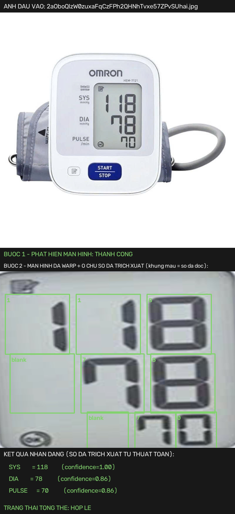
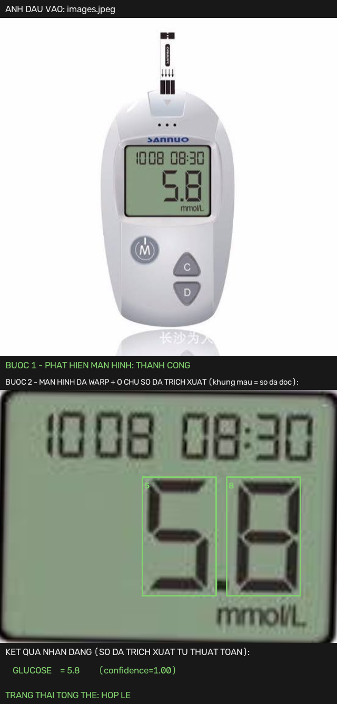
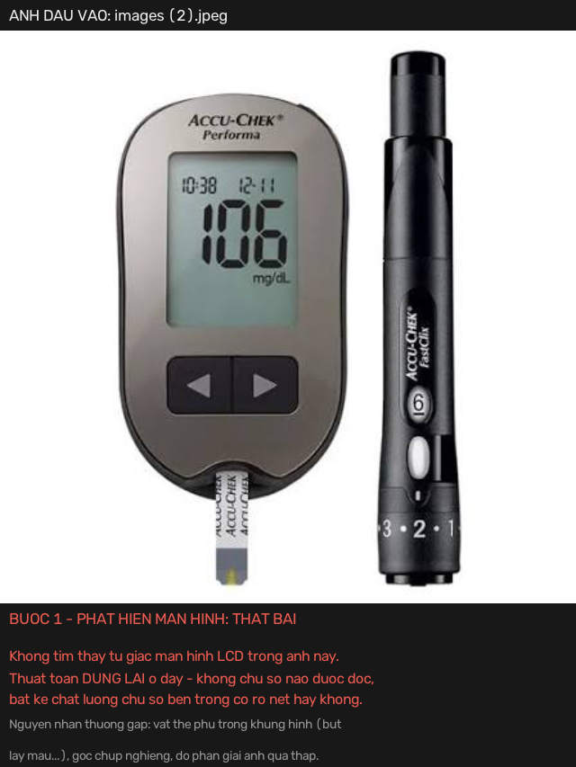

# BP Monitor OCR

Nhận dạng chỉ số hiển thị dạng 7 đoạn (7-segment) từ ảnh chụp màn hình **bất kỳ loại máy
đo điện tử nào** (máy đo huyết áp, máy đo đường huyết, nhiệt kế điện tử...) bằng thuật
toán rule-based thuần túy (OpenCV) — không cần huấn luyện, không cần GPU.

**Đọc kỹ mục [Cách hoạt động & Giới hạn](#cách-hoạt-động--giới-hạn) trước khi dùng** —
đây là thuật toán dựa trên luật cố định (không phải machine learning), thành công hay
thất bại phụ thuộc gần như hoàn toàn vào việc có khoanh được đúng vùng màn hình LCD
trong ảnh hay không. Muốn hiểu **chi tiết từng bước thuật toán** (dành cho người mới, có
sơ đồ + ví dụ tính tay), xem **[ALGORITHM.md](ALGORITHM.md)**.

## Ví dụ

| Thành công (số nguyên) | Thành công (số thập phân) | Thất bại |
|---|---|---|
|  |  |  |
| Khoanh đúng màn hình → đọc đúng cả 3 số, kèm confidence từng số. | Máy đo đường huyết đơn vị mmol/L (hiển thị "5.8") — nhờ `decimal_digits` trong device profile, đọc đúng **5.8**, không bị làm tròn nhầm thành số nguyên "58". | Không khoanh được màn hình (do bút lấy máu che một phần khung hình) → thuật toán dừng lại, báo lỗi rõ ràng thay vì đoán bừa. |

Ảnh trên do chính `scripts/visual_report.py` sinh ra — bạn có thể tự chạy lại lệnh này
trên ảnh của mình để xem trực quan thuật toán "nhìn thấy" gì.

## Cách hoạt động & Giới hạn

Pipeline gồm 2 bước, và **bước 1 quyết định tất cả**:

1. **Phát hiện màn hình** (`screen_detection.py`): dùng Canny edge detection + tìm
   contour tứ giác lớn nhất trong ảnh, coi đó là màn hình LCD, rồi warp (perspective
   transform) về nhìn chính diện. Đây là bước dựa trên luật hình học đơn giản — **không
   học từ dữ liệu**, nên không có khả năng "đoán" khi ảnh khó, chỉ có đúng hoặc dừng lại.
2. **Nhận dạng từng chữ số** (`rule_based.py`): với mỗi ô chữ số (tọa độ khai báo sẵn
   trong device profile), đo tỷ lệ pixel sáng trong 7 vùng đoạn a–g, so khớp với 10 mẫu
   0–9 để chọn chữ số khớp nhất.

**Hệ quả trực tiếp:** nếu bước 1 thất bại, thuật toán dừng ngay (`ScreenNotFoundError`)
— **không có chữ số nào được đọc, dù chữ số trong ảnh có rõ nét đến đâu.** Đây không phải
lỗi vặt cần vá, mà là đặc điểm cấu trúc của phương pháp rule-based: nó chỉ hoạt động tốt
trên ảnh mà vùng màn hình tạo thành một tứ giác rõ ràng, tương phản tốt với nền.

Các điều kiện ảnh làm bước 1 thất bại (quan sát thực tế, xem [Kết quả đánh giá](#kết-quả-đánh-giá)):
- Có vật thể khác trong khung hình cạnh tranh về kích thước/hình dạng với màn hình (vd
  bút lấy máu để cạnh máy đo).
- Ảnh chụp góc nghiêng mạnh khiến màn hình không còn là tứ giác rõ ràng sau khi xấp xỉ đa giác.
- Độ phân giải ảnh gốc quá thấp (dưới ~300px chiều nhỏ nhất) — không đủ chi tiết cạnh.

Ngay cả khi bước 1 thành công, bước 2 cũng có giới hạn riêng:
- **Không zero-shot**: mỗi model máy đo cần một file device profile khai báo tọa độ
  từng ô chữ số (`digit_rois`), đo thủ công từ ảnh mẫu thật của đúng model đó. Không tự
  suy ra được cho model chưa từng thấy.
- **Font số không thẳng trục** (in nghiêng/kiểu italic): các vùng đoạn a–g hiện giả định
  đoạn ngang nằm ngang, đoạn dọc thẳng đứng — font nghiêng làm sai lệch phép đo.

## Kết quả đánh giá

Đánh giá thật trên 12 ảnh sản phẩm thực tế (8 model máy đo khác nhau, không phải ảnh tổng
hợp), dùng chính `scripts/evaluate.py`:

| Chỉ số | Kết quả | Diễn giải |
|---|---|---|
| Tỷ lệ phát hiện màn hình (bước 1) | 7/12 = **58.3%** | nghẽn cổ chai chính |
| Độ chính xác chữ số (khi bước 1 thành công) | 22/23 = **95.7%** | bước 2 rất chính xác khi có input sạch |
| Độ chính xác toàn ảnh (mọi trường đúng) | 6/12 = **50.0%** | |
| Confidence trung bình (khi có kết quả) | **0.94** | hệ thống "biết" khi nó tự tin |

**Đọc đúng nghĩa:** thuật toán nhận dạng chữ số (bước 2) hoạt động tốt (~96%); phần lớn
thất bại đến từ bước phát hiện màn hình (bước 1), không phải từ việc đọc sai chữ số.

## Cài đặt

```bash
git clone <repo-url>
cd bp-monitor-ocr
python3 -m venv .venv
source .venv/bin/activate
pip install -r requirements.txt
```

## Sử dụng

```bash
# 1. Xem trực quan: anh dau vao + tung buoc xu ly + so da trich xuat (khuyen dung khi moi bat dau)
python scripts/visual_report.py --image duong/dan/anh.jpg \
    --device-profile configs/device_profiles/omron_hem7121.yaml \
    --output report.png

# 2. Quet nhanh, in bang ket qua ra terminal + luu anh debug tung o chu so
python scripts/quick_test.py --image duong/dan/anh.jpg --device-profile configs/device_profiles/omron_hem7121.yaml

# 3. CLI don gian, in JSON ra stdout (de tich hop vao he thong khac)
python scripts/run_inference.py --image duong/dan/anh.jpg --device-profile configs/device_profiles/omron_hem7121.yaml

# 4. Demo web qua trinh duyet
streamlit run app.py

# 5. Danh gia hang loat theo nhan co san (xem --help de biet dinh dang labels.json)
python scripts/evaluate.py --images data/raw --labels data/raw/labels.json --device-profile configs/device_profiles/omron_hem7121.yaml

# 6. REST API (goi tu he thong khac qua HTTP, bat ky ngon ngu nao)
uvicorn api:app --host 0.0.0.0 --port 8000
```

## Tích hợp vào hệ thống khác

Xem **[INTEGRATION.md](INTEGRATION.md)** — hướng dẫn đầy đủ 3 cách tích hợp (thư viện
Python / CLI / REST API qua `api.py`), hợp đồng đầu vào-đầu ra, cách xử lý lỗi, và lưu ý
vận hành quan trọng (tỷ lệ phát hiện màn hình thực tế, không phải thiết bị y tế đã kiểm
định). Có kèm `Dockerfile` để đóng gói `api.py` thành container.

### Thêm một loại máy đo mới

Không cần sửa code — chỉ cần tạo 1 file YAML mới trong `configs/device_profiles/`:

```yaml
name: ten_may_do
screen_size: [640, 480]   # kich thuoc anh sau khi warp ve chinh dien
invert: true              # true neu chu so sang tren nen toi (thuong dung cho LCD)
min_confidence: 0.6       # nguong confidence toi thieu (khong bat buoc, mac dinh 0.6)

fields:                   # so luong truong tuy y, ten truong tuy y (sys/dia/pulse, glucose...)
  ten_truong:
    digit_rois:            # ROI [x, y, w, h] rieng cho TUNG o chu so (khong chia deu)
      - [x, y, w, h]
    valid_range: [low, high]  # gioi han ky thuat hop ly (khong bat buoc)
    decimal_digits: 1         # so o TINH TU BEN PHAI la phan thap phan, vd "5.8" (khong bat buoc, mac dinh 0)

greater_than:              # danh sach (a, b): truong a phai lon hon truong b (khong bat buoc)
  - [truong_a, truong_b]
```

**Quy trình đo `digit_rois` từng bước, kèm script mẫu và cách debug khi sai:** xem
**[docs/CALIBRATION_GUIDE.md](docs/CALIBRATION_GUIDE.md)**. Tóm tắt nhanh: quan trọng
nhất là mỗi ROI phải rộng bằng **cả ô chữ số** (như thể nó chứa số "8"), không phải
bounding box sát nét chữ số thực tế đang hiển thị — xem [ALGORITHM.md](ALGORITHM.md) mục
"Bước 5" để hiểu vì sao.

## Đề xuất cải tiến: huấn luyện có giám sát nếu có dataset

Toàn bộ pipeline hiện tại **không dùng machine learning** — đây là lựa chọn có chủ đích để
tránh phụ thuộc dữ liệu huấn luyện. Dự án từng thử một nhánh CNN dự phòng huấn luyện trên
dữ liệu 7-segment tổng hợp (render + augment tự động), nhưng đã gỡ bỏ vì domain gap: CNN
chỉ tổng quát tốt trên chính kiểu dữ liệu tổng hợp nó được huấn luyện, không tổng quát
sang ảnh chụp thật (xem lịch sử commit / phần "Đã thử và bỏ" bên dưới).

**Nếu có một bộ dữ liệu ảnh thật đã gán nhãn** (nhiều ảnh cho mỗi model máy, nhiều điều
kiện chụp: góc nghiêng, ánh sáng, độ phân giải), hai hướng sau nhiều khả năng sẽ nâng
hiệu suất cao hơn đáng kể so với rule-based thuần túy, đặc biệt cho đúng 2 điểm yếu đã
đo được ở trên:

1. **Phát hiện màn hình bằng model học được** (vd một detector nhẹ kiểu YOLO/segmentation
   cho riêng lớp "màn hình LCD") thay cho contour + Canny cố định — sẽ xử lý được các ca
   hiện đang thất bại 100% (vật thể phụ trong khung hình, góc nghiêng mạnh) vì học được
   đặc trưng thị giác của màn hình thay vì chỉ dựa vào hình học tứ giác.
2. **CNN nhận dạng chữ số huấn luyện trên ảnh thật** (không phải ảnh tổng hợp) cho đúng
   các model máy đang dùng — sẽ xử lý được trường hợp font nghiêng và các ca biên rule-based
   đang đọc sai, vì học trực tiếp phân bố pixel thật thay vì so khớp mẫu hình học cố định.

Ngưỡng để hướng này đáng làm: cần tối thiểu vài trăm ảnh thật/model, có nhãn đúng, đa
dạng điều kiện chụp — ít hơn khó tổng quát tốt hơn rule-based hiện tại.

## Cấu trúc dự án

```
bp-monitor-ocr/
├── ALGORITHM.md                 # thuat toan + luong xu ly chi tiet, danh cho nguoi moi
├── app.py                       # demo Streamlit: upload anh, chon device profile, xem ket qua
├── api.py                       # REST API tich hop he thong khac (xem INTEGRATION.md)
├── Dockerfile                   # dong goi api.py thanh container
├── INTEGRATION.md               # huong dan tich hop: thu vien / CLI / REST API
├── configs/device_profiles/     # ten truong, ROI tung o chu so, gioi han hop le theo tung model may
├── data/
│   ├── raw/                     # anh that thu thap duoc (khong commit, xem .gitignore)
│   └── samples/                 # anh mau de test nhanh pipeline
├── docs/
│   ├── CALIBRATION_GUIDE.md      # huong dan tao device profile cho model may moi, tung buoc
│   └── examples/                 # anh minh hoa (sinh boi scripts/visual_report.py)
├── src/bp_ocr/
│   ├── schema.py                  # kieu du lieu dau ra (DigitPrediction, ReadingResult...)
│   ├── screen_detection.py        # Buoc 1-2 (ALGORITHM.md): phat hien man hinh + warp
│   ├── preprocessing.py           # Buoc 3: grayscale, contrast, threshold, morphology
│   ├── roi.py                     # Buoc 4: tach tung truong + tung o chu so theo device profile
│   ├── rule_based.py              # Buoc 5: nhan dang 7-segment bang so khop mau
│   ├── postprocess.py             # Buoc 6: ghep digit -> so (ho tro thap phan), kiem tra logic
│   └── pipeline.py                # orchestration toan bo pipeline (ReadingPipeline)
├── scripts/
│   ├── visual_report.py           # sinh anh bao cao truc quan (anh vao tren, ket qua duoi)
│   ├── quick_test.py              # quet nhanh 1 anh, in bang + luu anh debug
│   ├── run_inference.py           # CLI don gian, in JSON
│   └── evaluate.py                # danh gia hang loat theo 3 cap do (digit/truong/anh)
└── tests/                         # pytest
```

## License

MIT — xem file `LICENSE`.
